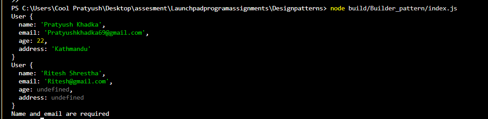

# Builder Pattern: User Construction

## Purpose
Constructs `User` objects step-by-step with clear validation for required fields.

## Key Features
- **Fluent interface** (method chaining)
- **Validation** in `build()` method
- **Immutable objects** after creation

## Expected Output
