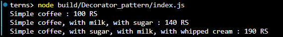

# Decorator Pattern: Coffee Shop

## Purpose
Dynamically add toppings to coffee without modifying existing classes.

## Key Components
- **Component**: `Coffee` interface
- **Concrete Component**: `SimpleCoffee`
- **Decorators**: `WithMilk`, `WithSugar`, `WithWhippedCream`

## Expected Output
