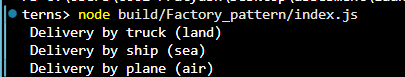

# Factory Pattern: Logistics System

## Purpose
Creates different transport types (Truck/Ship/Plane) without exposing instantiation logic.

## Key Features
- Centralized object creation via `LogisticsFactory`
- Common `Transport` interface for all delivery types
- Easy to extend (add new transport types)

## Expected Output

