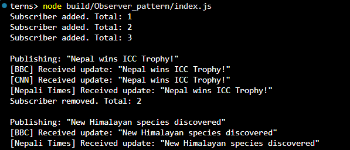

# Observer Pattern: News Agency

## Purpose
Implement a publish-subscribe system where news channels automatically get updates.

## Key Components
- **Subject**: `NewsAgency` (the publisher)
- **Observers**: `NewsChannel` (subscribers)
- **Interfaces**: Defines contract between components

## How to Run
1. Compile: `npx tsc`
2. Execute: `node build/observer_pattern/index.js`

## Expected Output

