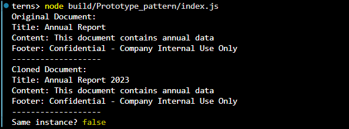

# Prototype Pattern: Document Templates

## Purpose
Create new documents by cloning pre-configured templates while keeping the original unchanged.

## Key Features
- **Clone Method**: Creates independent copies of objects
- **Cost-Efficient**: Avoids expensive re-creation of complex objects
- **Customization**: Easy to modify cloned instances

## Expected Output
