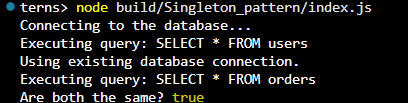

# Singleton Pattern Implementation

## Overview
This implementation demonstrates the Singleton design pattern in TypeScript, ensuring only one instance of a database connection exists throughout the application.

## Key Features
- **Single Instance**: Guarantees only one database connection exists
- **Lazy Initialization**: Creates the instance only when first requested
- **Global Access**: Provides controlled access via `getInstance()` method
- **Thread Safety**: Safe for Node.js environments

## Implementation Details
The solution consists of two files:

1. **databaseConnection.ts**  
   Contains the `DatabaseConnection` class with:
   - Private constructor to prevent direct instantiation
   - Static `getInstance()` method for controlled access
   - Query execution capability

2. **index.ts**  
   Demonstrates usage by:
   - Getting the singleton instance twice
   - Executing sample queries
   - Verifying instance equality

## Expected Behavior
When executed, the program will:
1. Connect to the database on first `getInstance()` call
2. Reuse the existing connection on subsequent calls
3. Log all query executions
4. Confirm single instance existence (`true` when comparing references)

## Design Considerations
- Suitable for resource-heavy objects like database connections
- Not recommended for testable code (consider dependency injection instead)
- Simple implementation assumes single-threaded Node.js environment

## output 
